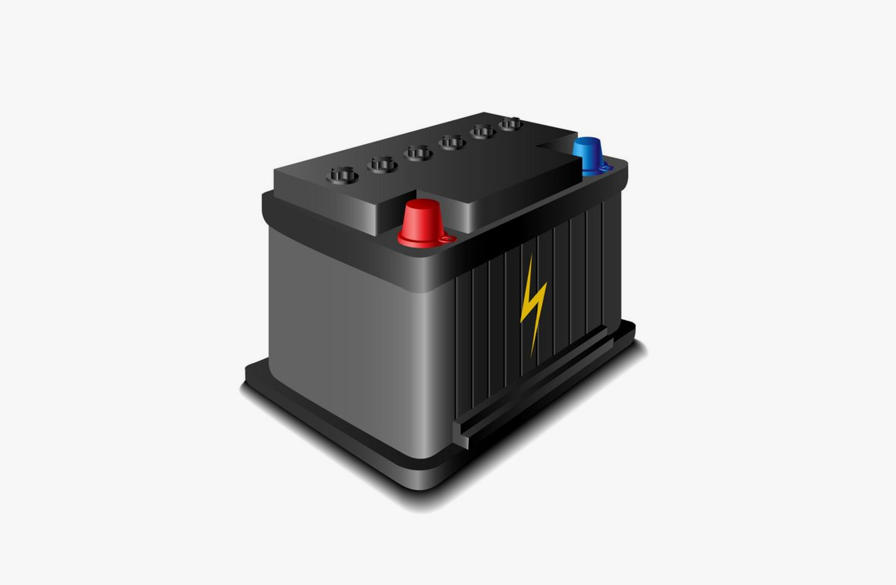
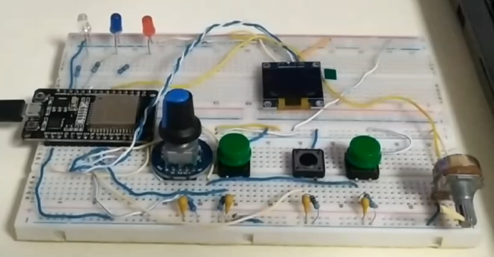
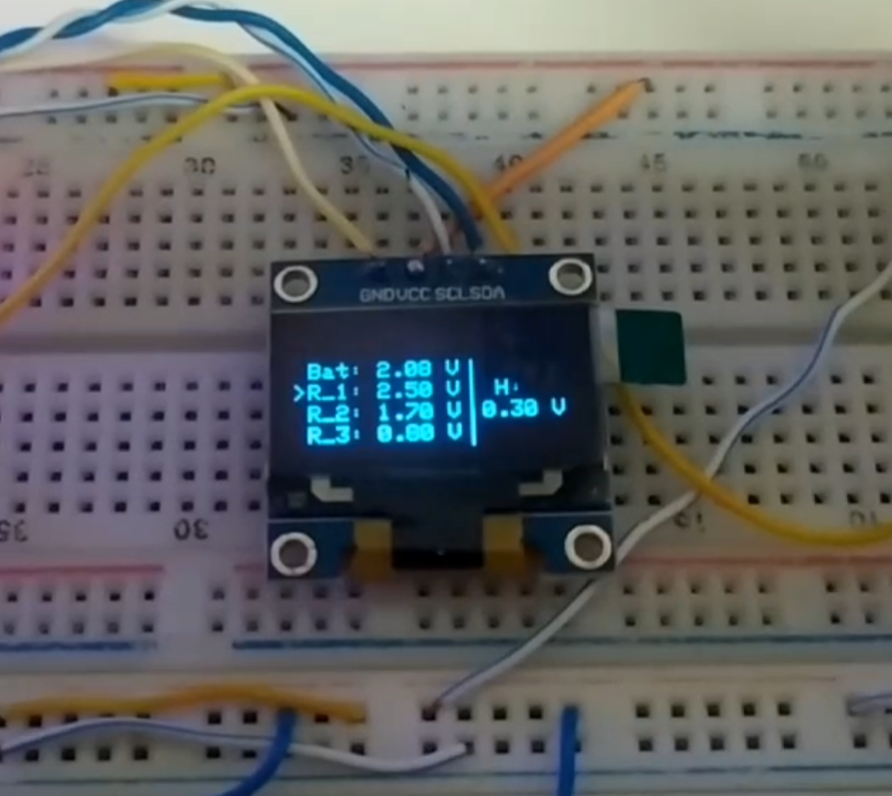
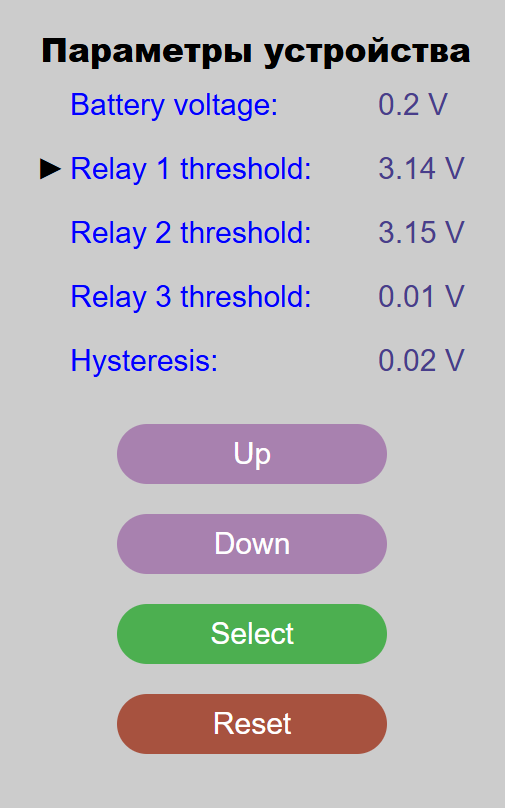

# Модуль разряда аккумулятора

Данный проект был разработан с целью создания удобного инструмента для автоматизированного разряда аккумулятора с изменением его нагрузки.

Работа проекта показана в [видео-демонстрации](https://drive.google.com/file/d/1iJnOz--jUWokzwbItVMHYExRhHu9hE0W/view?usp=sharing).

### Используемые в проекте технологии

Используемые технологии при создании проекта:
* Arduino IDE (версия 2.3.4)
* Версия ядра esp-32: 2.0.15 (by Espressif Systems)
* Установленные библиотеки:
  * Adafruit BusIO by Adafruit (1.17.0)
  * Adafruit GFX Library by Adafruit (1.12.0)
  * Adafruit SSD1306 by Adafruit (2.5.13)

Основные компоненты проекта:
* Отладочная плата ESP32 NODEMCU DEVKIT V1
* Дисплей OLED на базе чипа SD1306 (128x64)
* Резисторы, конденсаторы, светодиоды, кнопки...

### Функциональность проекта

Данное устройство обладает возможностью измерять напряжение аккумулятора и регулировать нагрузку в соответствии с заданным пользователем алгоритмом. Для этого используются три реле, которые могут коммутировать как небольшие нагрузки, так и нагрузки, обеспечивающие большой ток разряда. Для их эмуляции использовались светодиоды, которые видны ниже на макете устройства.

Для настройки доступны напряжения отключения реле и значение ширина петли гистерезиса, которая для всех реле является одинаковой. Данные вводятся при помощи кнопок (слева направо) **"RESET"**, **"SELECT"**, **"UP"** и **"DOWN"**. Вводимые данные и текущее значение напряжения отображаются на дисплее.

Также настройки вместе с функциональными кнопками дублируются на веб-странице, обработкой которой занимается веб-сервер на esp32. Благодаря этому можно удаленно настраивать параметры системы и в реальном времени следить за напряжением аккумулятора.

